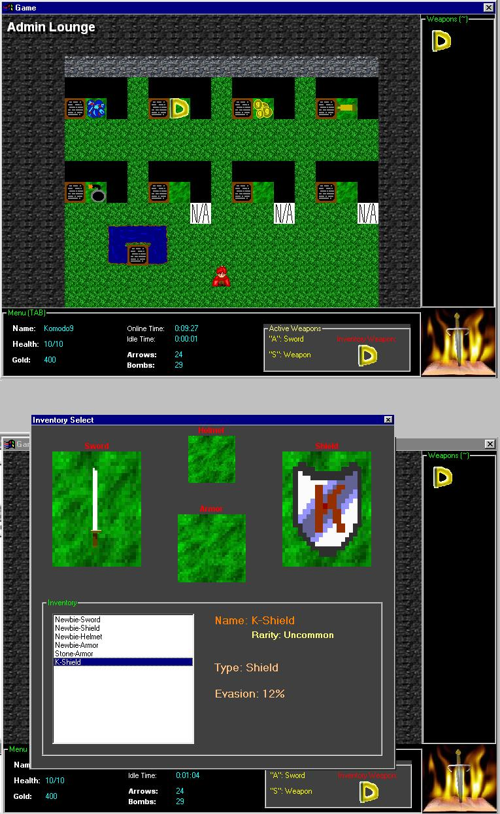

<div align="center">

## An RPG Game Similar to Graal \(only not quite as good =\)


</div>

### Description

If you are at all interested in Game Development, you should definately check this out and AT LEAST look at the screen shot. This is an online game which i started a while ago and am yet to finish. My main reason for publishing this is to try to find other programmers/plot writters/graphics makers/music people/level makers/etc. for the finished game. This game has swords (that you can find and equipt with different attack powers), items (like lockets, special arrows, special bombs, money, etc.), equiptment (you have swords (atk power), shields (evasion chance %), helmet (+ to defense), armor (+ to defense), etc.). This game has tile features like bushes that when attacked, are shreded and there is a chance of a random item being left, walkable and non-walkable tiles. When you move, your guy even cycles through multiple sprites of walking. One of the biggest features in this game is PORGRAMMABLE NPCS!! I made a really simple language where you can make NPCs do dozens of things. There everything from visiblity scripts to checking the user's access prviledges on the game and letting him/her pass, or blocking the way. You have health and money (gold) and there is already quite a few maps made. Remember, this game is NOT finished. The online section doesn't wok yet, due to it being unfinished. When you login to offline, keep the username as Komodo9, i am having a database problem with the new user thing. I hope when you vote on this, you vote on what is done, all the database stuff, and game features, and do not take off credit because of it being incomplete, as i said it was. If you are interested in helping, please leave a comment and i will e-mail you. So far the game has come a log way, so enjoy. =D
 
### More Info
 
Please vote for this and leave comments on what i can do to improve it. =) If you would be interested in helping out, leave a comment and e-mail me.


<span>             |<span>
---                |---
**Submitted On**   |2001-04-06 17:08:40
**By**             |[Harry Maugans](https://github.com/Planet-Source-Code/PSCIndex/blob/master/ByAuthor/harry-maugans.md)
**Level**          |Advanced
**User Rating**    |3.6 (32 globes from 9 users)
**Compatibility**  |VB 6\.0
**Category**       |[Games](https://github.com/Planet-Source-Code/PSCIndex/blob/master/ByCategory/games__1-38.md)
**World**          |[Visual Basic](https://github.com/Planet-Source-Code/PSCIndex/blob/master/ByWorld/visual-basic.md)
**Archive File**   |[An RPG Gam18023462001\.zip](https://github.com/Planet-Source-Code/harry-maugans-an-rpg-game-similar-to-graal-only-not-quite-as-good__1-22198/archive/master.zip)

### API Declarations

```
Private Declare Function waveOutGetNumDevs Lib "winmm.dll" () As Long
Const TileWidth = 32
Const TileHeight = 32
Public Scrolling As Boolean
Public SignData As String
Dim OnlineHours As String
Dim OnlineMinutes As String
Dim OnlineSeconds As String
Dim IdleHours As String
Dim IdleMinutes As String
Dim IdleSeconds As String
Dim HitTmr As Integer
Public Dir As Integer
Public Dir2 As Integer
Public PX3 As Integer
Public PY3 As Integer
Public MBoxReturn As Boolean
Public Declare Function sndPlaySound Lib "winmm.dll" Alias "sndPlaySoundA" (ByVal lpszSoundName As String, ByVal uFlags As Long) As Long
Public Type ItemList2
 Bow As Boolean
 Arrows As Integer
 LongBow As Boolean 'Farther Range than a bow
 LongBowArrows As Integer
 Bomb As Boolean
 Bombs As Integer
 PowerBomb As Boolean 'Twice as powerful as bomb
 PowerBombs As Integer
 RBomb As Boolean 'Twice the Range as bomb
 RBombs As Integer
 BlowGun As Boolean 'Arrow-like movement detonates like a normal bomb on impact
 PowerCrystal As Boolean 'Doubles attack power for 5 sec; can only be used once
 SpeedCrystal As Boolean 'Doubles speed for 5 sec; can only be used once
 DefenseCrystal As Boolean 'Doubles Defense for 5 sec; can only be used once
 PowerLocket As Boolean 'Doubles attack power for 10 sec; can only be used once
 SpeedLocket As Boolean 'Doubles speed for 10 sec; can only be used once
 DefenseLocket As Boolean 'Doubles Defense for 10 sec; can only be used once
 GoldenCrystal As Boolean 'Doubles attack, speed, and defense for 5 sec; can only be used once
 GoldenLocket As Boolean 'Doubles attack, speed, and defense for 10 sec; can only be used once
End Type
Public Type NPC3
 Name As New Collection
 Height As New Collection
 Width As New Collection
 XPos As New Collection
 YPos As New Collection
 GifPath As New Collection
 ScriptSource As New Collection
End Type
Public Type Map2
 Gold As New Collection
 Bushes As New Collection
 Arrows As New Collection
 Bombs As New Collection
 MapName As String
 MapFileName As String
 MapData As String
 Music As String
 MapHeight As Integer
 MapWidth As Integer
 MapX As Integer
 MapY As Integer
 MapTemp As String
 MapBoxes As New Collection
 NPCs As NPC3
 Warps As New Collection
 Signs As New Collection
 TotalMapData As String
End Type
Public Type Online2
 Account As String
 Password As String
End Type
Type Direction2
 Up As Boolean
 Down As Boolean
 Left As Boolean
 Right As Boolean
 Dead As Boolean
 Stopped As Boolean
End Type
Public Type Player2
 Gold As Integer
 Arrows As Integer
 Bombs As Integer
 PlayerType As String
 Direction As Direction2
 Name As String
 Health As Integer
 AttackPower As Integer
 Defense As Integer
 Evasion As Integer
 Speed As Integer
 ItemList As ItemList2
 PlayerX As Integer
 PlayerY As Integer
 MapPos As String
 Map As Map2
 MapTile(0 To 9, 0 To 9)
 SwingingSword As Boolean
 Online As Online2
End Type
Public Player As Player2
Public p2 As Player2
Const TileWidth = 32
Const TileHeight = 32
Dim titleclose As Boolean
Dim Mode As Integer
```


